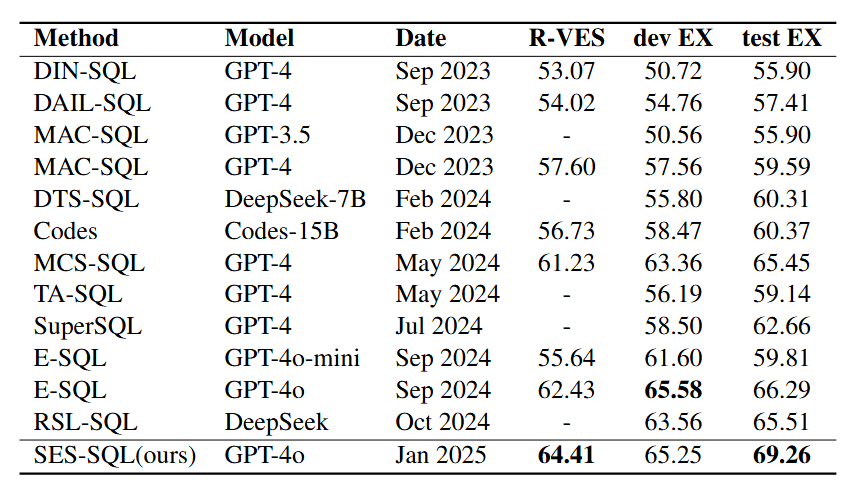

<div style="text-align: center;">
  <h1>SES-SQL: A Simple Yet Effective Stepwise Prompting Framework for Text-to-SQL</h1>
</div>

<h2>Overview</h2>


<h3>1. Clause Decomposition</h3>

We decompose the natural language question into logical clauses based on semantic units and incorporate this information into the prompt, allowing the LLM to generate Pre-SQL. 
At this stage of generating Pre-SQL, we ensure that the model fully utilizes the information from the **Question** and **hint**, as well as the DB schema information without value details.

<h3>2. SQL-based Value Extractor</h3>

We instruct the model to extract the tables and columns involved in the Pre-SQL and then construct the following information:

1. In the DB schema where the tables and columns involved in the Pre-SQL are masked, the model is tasked to explore potential table and column information based on the Question.

2. For the tables and columns involved in the Pre-SQL, a value condition checker is used to further filter out the columns related to value condition judgments: 

   ​	2.1 For columns involved in value condition judgments, similarity search methods are used to provide value examples with high similarity to the keywords in the natural language question. 

   ​	2.2 For columns not involved in value condition judgments, SQL queries are directly constructed to fetch value examples.

3. For the tables and columns involved in the Pre-SQL, if their relationships are incorrect or if there are errors in table names or column names, all errors are captured using SQL.

In summary, three pieces of information will be obtained:

1. Simplified DB schema information with the Pre-SQL tables and columns masked.
2. Value example information based on the Pre-SQL.
3. Potential error information in the Pre-SQL.

Then, the model is allowed to correct the Pre-SQL based on the information obtained above.

<h3>3. Refinement of Database Feedback</h3>

Execute the Second-SQL on the database, then integrate the execution results with the prompt as input for the model. Instruct the model to analyze whether the execution results of the Second-SQL are reasonable and refine the Second-SQL accordingly to produce the Final-SQL.

<h2>Project directory structure</h2>


```plaintext
pre-second-SQL/
├── README.md
├── requirements.txt
│
├── data/
│   └── databases/
│		└── dev_20240627/
│
├── data_process/
│   └── sql_data_process_BIRD.py
│
├── run/
│   └── Pre_Second_SQL.py
│
└── tools/
```

<h2>Environment</h2>


```python
conda create -n ICL-SQL python=3.10
conda activate ICL-SQL
pip install -r requirements.txt
```

<h2>RUN</h2>


<h3>1. Data Preprocessing</h3>

Please place the test set files in the directory data/database/. Then set the path parameters. 

In data_process_config.py, you need to set SQL_DATA_INFO and DATABASE_PATH. The parameters you need to set in SQL_DATA_INFO include ‘data_source’, ‘file’, ‘tables_file’, ‘database_name’.

```python
cd data_process/
python sql_data_process_BIRD.py
```

Four files are generated after execution.

1. all_mappings.json
2. raw_format_data.json    
2. Pre_input.json
3. Second_input.json

<h3>2. Generate SQL</h3>

Please set the parameters of ICL-SQL. In ICL-SQL.py, mainly set database_file_path, start_idx and end_idx.

```python
cd run/
python ICL-SQL.py
```

You will get the generated SQL file in the output after execution.

<h3>3. Prompt tokens on dev set</h3>

20M input tokens       About $50

1.5M output tokens     About $15

<h2>Evaluation</h2>


In SQL, the order of columns in a `SELECT` statement can vary without affecting the correctness of the query results. For example:

1. `SELECT A, B FROM C;`
2. `SELECT B, A FROM C;`

Both queries retrieve the same data from table `C`, but the columns are presented in different orders.

Since SQL query results may contain multiple rows and columns, directly comparing the order of two result sets can lead to incorrect judgments. By sorting the elements within each tuple, it ensures that the element order is consistent when comparing result sets, thereby achieving a more reliable comparison.

Please run the following code to evaluate, and set the parameters accordingly.

```python
cd evaluation
python evaluation.py --predicted_sql_path ../output/ICL-SQL.sql --ground_truth_path ../data/database/dev_20240627/dev.sql --data_mode dev --db_root_path ../data/database/dev_20240627/dev_databases/ --diff_json_path ../data/database/dev_20240627/dev.json
```

<h2>Main Results</h2>

### Execution Accuracy



<h2>NOTE</h2>


1. The files in vector_data in the code were generated after running on the dev dataset, move all the files in vector_data elsewhere before you run on the test dataset.

2. The column_description in the csv file in database_description is used when running the dev dataset. If the content saved in column_meaning.json and the column_description in the csv file are similar content, then we need to use column_meaning.json.

3. API_KEYS has been placed in config files, specifically in data_process/data_process_config.py and run/run_config.py.

4. output/ICL-SQL-dev.sql holds the Dev SQL File, which is the file generated after running on the dev.

5. We currently have a balance of $120 US in our account, if this is not enough please contact us via email.
